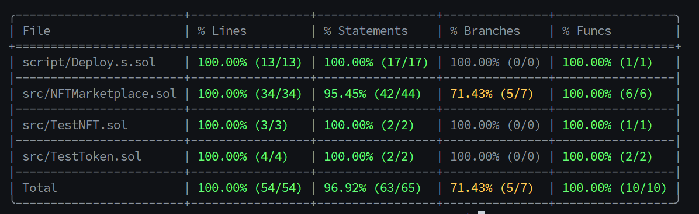
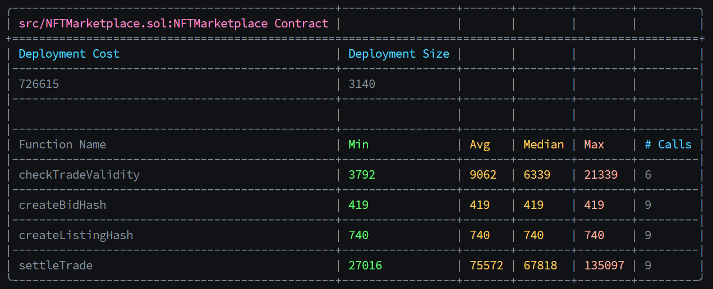

# Cheap NFT Marketplace

> A gas-efficient NFT marketplace using signature-based listings and bids.

## Table of Contents

- [Deployment](#deployment)
- [Features](#features)
- [Technical Details](#technical-details)
  - [Architecture](#architecture)
  - [Security](#security)
  - [Development](#development)
- [Testing](#testing)

## Deployment

Current deployments:

| Network          | Contract       | Address                                                                                                                      |
| ---------------- | -------------- | ---------------------------------------------------------------------------------------------------------------------------- |
| Arbitrum Sepolia | NFTMarketplace | [0x67f0f3b6a70aac231c7660e56ea63d73fd57be36](https://sepolia.arbiscan.io/address/0x67f0f3b6a70aac231c7660e56ea63d73fd57be36) |
| Arbitrum Sepolia | TestNFT        | [0xf42b64907cefef5972851b6475913c3981d7be32](https://sepolia.arbiscan.io/address/0xf42b64907cefef5972851b6475913c3981d7be32) |
| Arbitrum Sepolia | TestToken      | [0x678429e8e98fd5eae872a163a30b7ef6693bb2d7](https://sepolia.arbiscan.io/address/0x678429e8e98fd5eae872a163a30b7ef6693bb2d7) |

## Features

- ✨ Gasless listings and bids (pay gas only when trading)
- 🔒 Non-custodial - assets stay in users' wallets
- ⚡ Single-transaction settlement
- 🤝 Trustless trading with signature verification
- 📝 Support for any ERC721 and ERC20 tokens

## Technical Details

### Architecture

The marketplace operates through three main components:

1. **Listings**: Seller-signed intents to sell NFTs
2. **Bids**: Buyer-signed intents to purchase
3. **Settlement**: Valid trades can be executed by any party, though our microservice handles this process

### Security

- ✓ Signature replay protection
- ✓ Deadline-based expiration
- ✓ Non-custodial design
- ✓ No admin privileges
- ✓ Pre-trade validation
- ✓ Independent buyer/seller checks

### Development

```bash
# Install
forge install

# Test
forge test
forge test --match-test testSettleTrade
forge test --gas-report

# Coverage
forge coverage

# Deploy to Arbitrum Sepolia
forge script script/Deploy.s.sol:DeployScript \
    --rpc-url "https://sepolia-rollup.arbitrum.io/rpc" \
    --broadcast \
    --verify \
    --chain arbitrum-sepolia \
    --etherscan-api-key $ARBISCAN_API_KEY \
    --private-key $PRIVATE_KEY \
    -vvvv

```

## Testing

### Coverage Report



### Gas Analysis



## License

MIT License - see [LICENSE](LICENSE)
